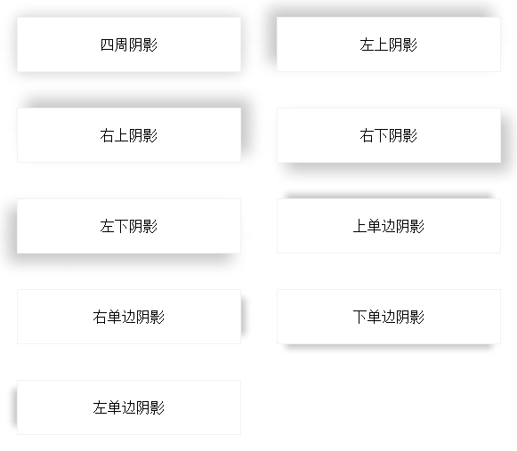
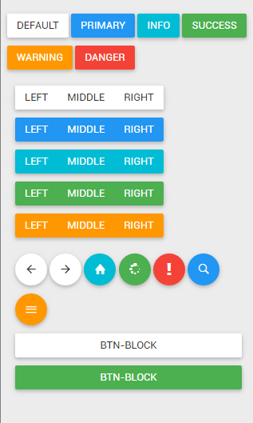

# web-demo-css
对《Web开发实战》这本书中的的css相关示例进行了完善和补充，欢迎大家购买这本书，支持作者！

## 《Web开发实战》
这是一本目前为止我看过的最棒的前端实战书籍，其中包含了很多非常实用的例子，同时作者对每一个示例都进行了详尽的解释

* [在线试看地址](https://www.kancloud.cn/dennis/javascriptmethod/261471)
* [购买地址](https://www.kancloud.cn/dennis/javascriptmethod)
* [作者个人博客](http://ghmagical.com/)

## 其他示例
由于示例比较多，放在一个工程中打开的时候加载很慢，所以我将`web-demo`分成了多个repo，具体列表如下：

* [web-demo-js](https://github.com/merrier/web-demo-js)
* [web-demo-css](https://github.com/merrier/web-demo-css)
* [web-demo-mobile](https://github.com/merrier/web-demo-mobile)
* [web-demo-canvas](https://github.com/merrier/web-demo-canvas)
* [web-demo-svg](https://github.com/merrier/web-demo-svg)

## 目录
> 我在这里只会给出代码，并不会给出解释，如果想要了解其中的原理，欢迎购买原书电子版（才￥5，强烈推荐购买！而且如果不购买原书的话，下面的有些原文地址打开是看不到作者的讲解的）

### 白光划过效果

[原文地址](https://www.kancloud.cn/dennis/javascriptmethod/261473)
[在线演示](http://merrier.github.io/web-demo-css/highlight/highlight.html)

### 3D立方体

[原文地址](https://www.kancloud.cn/dennis/javascriptmethod/261474)
[在线演示](http://merrier.github.io/web-demo-css/cude/cude.html)

### 水中倒影

[原文地址](https://www.kancloud.cn/dennis/javascriptmethod/261475)
[在线演示](http://merrier.github.io/web-demo-css/boxReflect/boxReflect.html)

### 工具提示

[原文地址](https://www.kancloud.cn/dennis/javascriptmethod/261476)
[在线演示](http://merrier.github.io/web-demo-css/tooltip/tooltip.html)

### 单选复选

[原文地址](https://www.kancloud.cn/dennis/javascriptmethod/261477)
[在线演示](http://merrier.github.io/web-demo-css/input/input.html)

### Loading加载

[原文地址](https://www.kancloud.cn/dennis/javascriptmethod/261478)
[在线演示](http://merrier.github.io/web-demo-css/loading/loading.html)

### 图片滤镜

[原文地址](https://www.kancloud.cn/dennis/javascriptmethod/261479)
[在线演示](http://merrier.github.io/web-demo-css/filter/filter.html)

### 阴影

[原文地址](https://www.kancloud.cn/dennis/javascriptmethod/261480)
[在线演示](http://merrier.github.io/web-demo-css/boxShadow/boxShadow.html)

### 3D按钮

[在线演示(普通按钮)](http://merrier.github.io/web-demo-css/button/button.html)

[在线演示(3D按钮)](http://merrier.github.io/web-demo-css/button/3dButton.html)

[原文地址](https://www.kancloud.cn/dennis/javascriptmethod/261481)

### 自定义滚动条

[原文地址](https://www.kancloud.cn/dennis/javascriptmethod/261482)
[在线演示](http://merrier.github.io/web-demo-css/scrollbar/scrollbar.html)

### 文字效果

[原文地址](https://www.kancloud.cn/dennis/javascriptmethod/261483)
[在线演示](http://merrier.github.io/web-demo-css/textShadow/text.html)

### 多彩的渐变

[原文地址](https://www.kancloud.cn/dennis/javascriptmethod/261484)
[在线演示](http://merrier.github.io/web-demo-css/linearGradient/linearGradient.html)

### 进度条

[原文地址](https://www.kancloud.cn/dennis/javascriptmethod/261485)
[在线演示](http://merrier.github.io/web-demo-css/progress/progress.html)

### 遮罩条

[原文地址](https://www.kancloud.cn/dennis/javascriptmethod/261486)
[在线演示](http://merrier.github.io/web-demo-css/overlay/overlay.html)

### 切角

[原文地址](https://www.kancloud.cn/dennis/javascriptmethod/261487)
[在线演示](http://merrier.github.io/web-demo-css/corner/corner.html)

### 表单

[原文地址](https://www.kancloud.cn/dennis/javascriptmethod/261488)
[在线演示](http://merrier.github.io/web-demo-css/form/form.html)

### 溢出省略号

[原文地址](https://www.kancloud.cn/dennis/javascriptmethod/261489)
[在线演示](http://merrier.github.io/web-demo-css/ellipsis/ellipsis.html)

### 自定义选择文本样式

[原文地址](https://www.kancloud.cn/dennis/javascriptmethod/261490)
[在线演示](http://merrier.github.io/web-demo-css/selection/selection.html)

### 表格

[原文地址](https://www.kancloud.cn/dennis/javascriptmethod/261491)
[在线演示](http://merrier.github.io/web-demo-css/table/table.html)

### 导航菜单

[原文地址](https://www.kancloud.cn/dennis/javascriptmethod/261492)
[在线演示](http://merrier.github.io/web-demo-css/nav/nav.html)

### 动态的边框

[原文地址](https://www.kancloud.cn/dennis/javascriptmethod/261493)
[在线演示](http://merrier.github.io/web-demo-css/border/border.html)

### 文件上传组件美化

[原文地址](https://www.kancloud.cn/dennis/javascriptmethod/261494)
[在线演示](http://merrier.github.io/web-demo-css/fileupload/upload.html)

### 打字机效果

[原文地址](https://www.kancloud.cn/dennis/javascriptmethod/261495)
[在线演示](http://merrier.github.io/web-demo-css/print/typewriter.html)

### 多形状图像

[原文地址](https://www.kancloud.cn/dennis/javascriptmethod/261496)
[在线演示](http://merrier.github.io/web-demo-css/shape/shape.html)

### 心跳灯和呼吸灯

[在线演示(心跳灯)](http://merrier.github.io/web-demo-css/breath/heartbeat.html)

[在线演示(呼吸灯)](http://merrier.github.io/web-demo-css/breath/breath.html)

[原文地址](https://www.kancloud.cn/dennis/javascriptmethod/261497)

### 竖着排的文字

[原文地址](https://www.kancloud.cn/dennis/javascriptmethod/261498)
[在线演示](http://merrier.github.io/web-demo-css/vertical/writting.html)

### 面包屑导航

[原文地址](https://www.kancloud.cn/dennis/javascriptmethod/261499)
[在线演示](http://merrier.github.io/web-demo-css/breadcrumb/breadcrumb.html)

### 首字母下沉

[原文地址](https://www.kancloud.cn/dennis/javascriptmethod/262477)
[在线演示](http://merrier.github.io/web-demo-css/letter/letter.html)

### 美化有序列表

[原文地址](https://www.kancloud.cn/dennis/javascriptmethod/262478)
[在线演示](http://merrier.github.io/web-demo-css/orderedList/orderedList.html)

### 缎带效果

[原文地址](https://www.kancloud.cn/dennis/javascriptmethod/262479)
[在线演示](http://merrier.github.io/web-demo-css/ribbon/ribbon.html)

### webpack盒子动画

[在线演示](http://merrier.github.io/web-demo-css/webpack-box/webpack-box.html)

### 花瓣动画

[出处](https://cssanimation.rocks/)
[在线演示](http://merrier.github.io/web-demo-css/flower/flower.html)

### 导航栏光标下划线跟随

[出处](https://juejin.im/post/5ab9e9056fb9a028be360292)
[在线演示](http://merrier.github.io/web-demo-css/underline-follow/underline-follow.html)

### Twitter点赞动效

[出处](https://www.w3cplus.com/animation/recreating-the-twitter-heart-animation.html)
[在线演示](http://merrier.github.io/web-demo-css/twitterDigg/twitterDigg.html)

### 3D滚动字幕

[出处](https://www.w3cplus.com/animation/wrapping-animated-3D-marquee-text-with-pure-CSS.html)
[在线演示](http://merrier.github.io/web-demo-css/3DRollingCaptions/3DRollingCaptions.html)

### CSS3地球仪

[出处](https://www.w3cplus.com/css3/spheres.html)
[在线演示](http://merrier.github.io/web-demo-css/globe/globe.html)

### 小雨打在窗户上的特效

[出处](https://www.w3cplus.com/css3/css-only-raindrops-on-window-effect.html)
[在线演示](http://merrier.github.io/web-demo-css/rainHitWindow/rainHitWindow.html)

### 蝴蝶飞舞

[出处](https://www.w3cplus.com/blog/172.html)
[在线演示](http://merrier.github.io/web-demo-css/butterfly/butterfly.html)

### 旋转魔方

[出处](https://juejin.im/post/5ae1a75a6fb9a07ac3632c8c)
[在线演示](http://merrier.github.io/web-demo-css/revolveCube/revolveCube.html)

### 光束和波浪

[出处](https://blog.csdn.net/findhappy117/article/details/79208058)
[在线演示](http://merrier.github.io/web-demo-css/beamWave/beamWave.html)